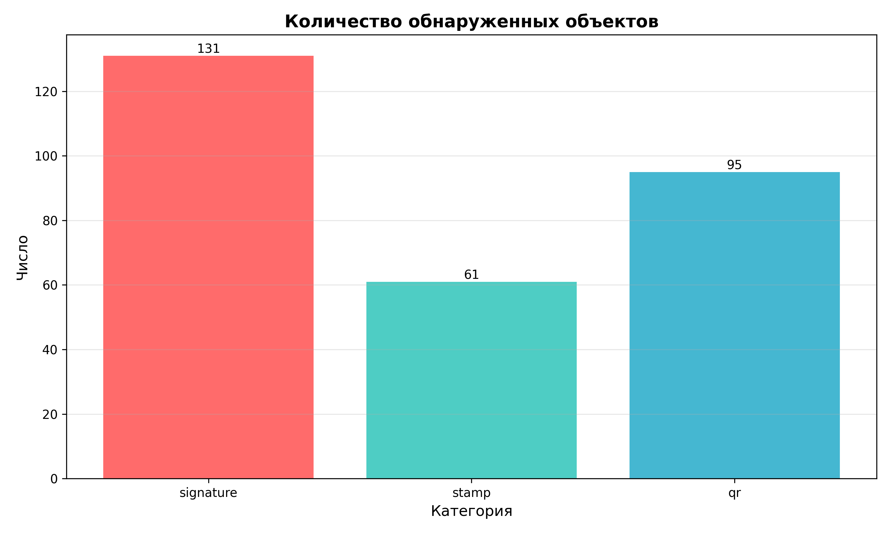
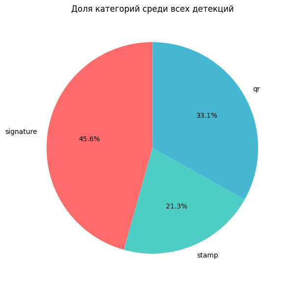
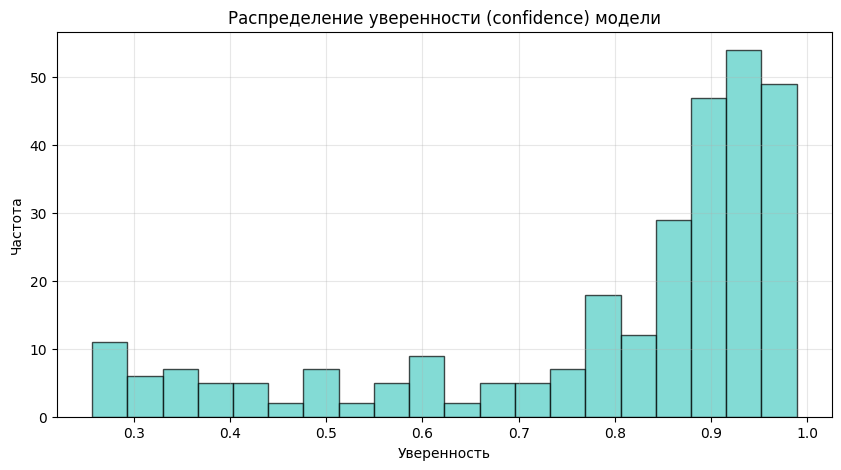
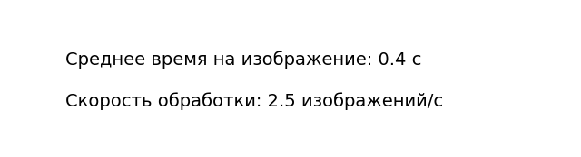
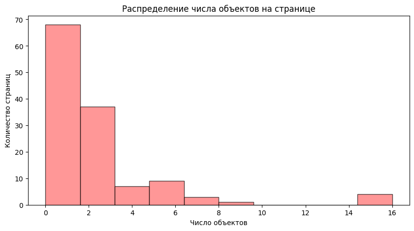

# 🚀 Digital Inspector: Automatic Detection of Signatures, Stamps, and QR Codes in Documents

> **"Digital Inspector" — your assistant for automating routine verification of construction documents.**

Scans PDF or PNG → detects **signatures, stamps, QR codes** → marks them with bounding boxes → saves results as JSON → displays statistics.

✅ Visual output  
✅ Web interface (Gradio)  
✅ JSON results  
✅ Performance charts  
✅ Works with PDFs and images  

---

## 🎯 Objective

Manually reviewing documents is slow and tedious. Our "Digital Inspector" automates basic checks:

- ✅ Detects **signatures**  
- ✅ Detects **stamps / seals**  
- ✅ Detects **QR codes**  

And does it **visually** — with bounding boxes overlaid on the image and structured data exported to JSON.

---

## 🖼️ Example Workflow

### 1. Web Interface (Gradio)

Upload a PDF or PNG — see detections in real time.


---

### 2. Detection Statistics

How many objects of each type did the model find?



---

### 3. Category Distribution

What’s the proportion of signatures, stamps, and QR codes?



---

### 4. Model Confidence

How confident is the model in its predictions?



---

### 5. Processing Speed

Average processing time per image



---

### 6. Objects per Page

How many objects appear on a single page? 



---

## ⚙️ How to Run

### 1. Install dependencies

```bash
pip install -r requirements.txt
```

